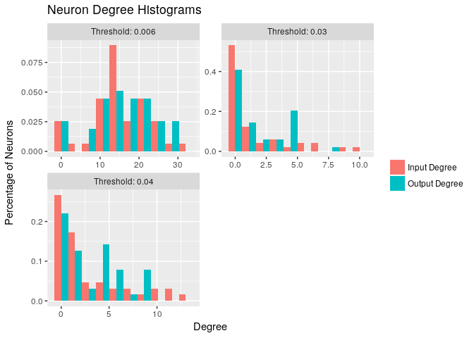
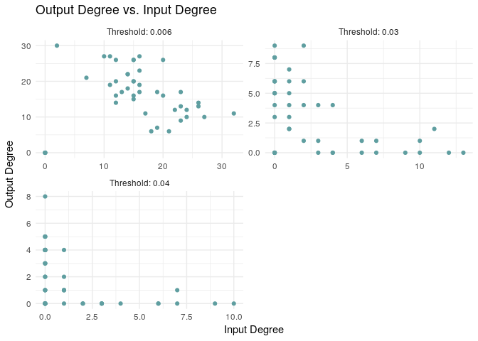
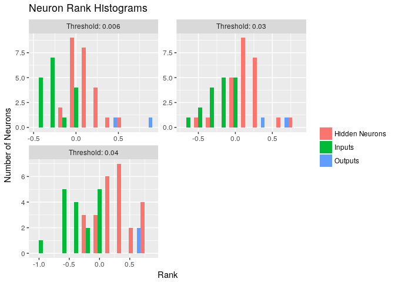

CS294
================
Benjamin Kha
April 26, 2018

``` r
library(ggplot2)
library(reshape2)
library(ggthemes)
```

``` r
df <- read.csv('test.csv')
names(df) <- c('Input Degree', 'Output Degree')
df1 <- read.csv('test1.csv')
names(df1) <- c('Input Degree', 'Output Degree')
df2 <- read.csv('test2.csv')
names(df2) <- c('Input Degree', 'Output Degree')
```

``` r
new_df <- data.frame(degree=df$'Input Degree')
new_df$'type' <- 'Input Degree'
new_df_2 <- data.frame(degree=df$'Output Degree')
new_df_2$'type' <- 'Output Degree'
new_df <- rbind(new_df, new_df_2)
new_df$threshold <- 'Threshold: 0.006'
new_df
```

    ##    degree          type        threshold
    ## 1      21  Input Degree Threshold: 0.006
    ## 2      23  Input Degree Threshold: 0.006
    ## 3      23  Input Degree Threshold: 0.006
    ## 4      17  Input Degree Threshold: 0.006
    ## 5      18  Input Degree Threshold: 0.006
    ## 6      22  Input Degree Threshold: 0.006
    ## 7       0  Input Degree Threshold: 0.006
    ## 8       0  Input Degree Threshold: 0.006
    ## 9      24  Input Degree Threshold: 0.006
    ## 10     26  Input Degree Threshold: 0.006
    ## 11     24  Input Degree Threshold: 0.006
    ## 12      0  Input Degree Threshold: 0.006
    ## 13      0  Input Degree Threshold: 0.006
    ## 14     32  Input Degree Threshold: 0.006
    ## 15     19  Input Degree Threshold: 0.006
    ## 16     26  Input Degree Threshold: 0.006
    ## 17     27  Input Degree Threshold: 0.006
    ## 18     10  Input Degree Threshold: 0.006
    ## 19      2  Input Degree Threshold: 0.006
    ## 20     15  Input Degree Threshold: 0.006
    ## 21     11  Input Degree Threshold: 0.006
    ## 22     12  Input Degree Threshold: 0.006
    ## 23     12  Input Degree Threshold: 0.006
    ## 24     16  Input Degree Threshold: 0.006
    ## 25     14  Input Degree Threshold: 0.006
    ## 26     12  Input Degree Threshold: 0.006
    ## 27     14  Input Degree Threshold: 0.006
    ## 28     15  Input Degree Threshold: 0.006
    ## 29     14  Input Degree Threshold: 0.006
    ## 30     15  Input Degree Threshold: 0.006
    ## 31     16  Input Degree Threshold: 0.006
    ## 32     20  Input Degree Threshold: 0.006
    ## 33     12  Input Degree Threshold: 0.006
    ## 34     11  Input Degree Threshold: 0.006
    ## 35     13  Input Degree Threshold: 0.006
    ## 36     15  Input Degree Threshold: 0.006
    ## 37     16  Input Degree Threshold: 0.006
    ## 38     15  Input Degree Threshold: 0.006
    ## 39     19  Input Degree Threshold: 0.006
    ## 40     15  Input Degree Threshold: 0.006
    ## 41     20  Input Degree Threshold: 0.006
    ## 42     16  Input Degree Threshold: 0.006
    ## 43      7  Input Degree Threshold: 0.006
    ## 44     23  Input Degree Threshold: 0.006
    ## 45      6 Output Degree Threshold: 0.006
    ## 46      9 Output Degree Threshold: 0.006
    ## 47     13 Output Degree Threshold: 0.006
    ## 48     11 Output Degree Threshold: 0.006
    ## 49      6 Output Degree Threshold: 0.006
    ## 50     12 Output Degree Threshold: 0.006
    ## 51      0 Output Degree Threshold: 0.006
    ## 52      0 Output Degree Threshold: 0.006
    ## 53     10 Output Degree Threshold: 0.006
    ## 54     13 Output Degree Threshold: 0.006
    ## 55     12 Output Degree Threshold: 0.006
    ## 56      0 Output Degree Threshold: 0.006
    ## 57      0 Output Degree Threshold: 0.006
    ## 58     11 Output Degree Threshold: 0.006
    ## 59      7 Output Degree Threshold: 0.006
    ## 60     14 Output Degree Threshold: 0.006
    ## 61     10 Output Degree Threshold: 0.006
    ## 62     27 Output Degree Threshold: 0.006
    ## 63     30 Output Degree Threshold: 0.006
    ## 64     15 Output Degree Threshold: 0.006
    ## 65     19 Output Degree Threshold: 0.006
    ## 66     20 Output Degree Threshold: 0.006
    ## 67     26 Output Degree Threshold: 0.006
    ## 68     27 Output Degree Threshold: 0.006
    ## 69     18 Output Degree Threshold: 0.006
    ## 70     14 Output Degree Threshold: 0.006
    ## 71     22 Output Degree Threshold: 0.006
    ## 72     16 Output Degree Threshold: 0.006
    ## 73     22 Output Degree Threshold: 0.006
    ## 74     20 Output Degree Threshold: 0.006
    ## 75     17 Output Degree Threshold: 0.006
    ## 76     16 Output Degree Threshold: 0.006
    ## 77     16 Output Degree Threshold: 0.006
    ## 78     27 Output Degree Threshold: 0.006
    ## 79     17 Output Degree Threshold: 0.006
    ## 80     26 Output Degree Threshold: 0.006
    ## 81     19 Output Degree Threshold: 0.006
    ## 82     26 Output Degree Threshold: 0.006
    ## 83     17 Output Degree Threshold: 0.006
    ## 84     20 Output Degree Threshold: 0.006
    ## 85     26 Output Degree Threshold: 0.006
    ## 86     23 Output Degree Threshold: 0.006
    ## 87     21 Output Degree Threshold: 0.006
    ## 88     17 Output Degree Threshold: 0.006

``` r
new_df1 <- data.frame(degree=df1$'Input Degree')
new_df1$'type' <- 'Input Degree'
new_df1_2 <- data.frame(degree=df1$'Output Degree')
new_df1_2$'type' <- 'Output Degree'
new_df1 <- rbind(new_df1, new_df1_2)
new_df1$threshold <- 'Threshold: 0.04'
new_df1
```

    ##    degree          type       threshold
    ## 1       6  Input Degree Threshold: 0.04
    ## 2       9  Input Degree Threshold: 0.04
    ## 3       6  Input Degree Threshold: 0.04
    ## 4       4  Input Degree Threshold: 0.04
    ## 5       7  Input Degree Threshold: 0.04
    ## 6       4  Input Degree Threshold: 0.04
    ## 7       0  Input Degree Threshold: 0.04
    ## 8       0  Input Degree Threshold: 0.04
    ## 9      10  Input Degree Threshold: 0.04
    ## 10     12  Input Degree Threshold: 0.04
    ## 11     10  Input Degree Threshold: 0.04
    ## 12      0  Input Degree Threshold: 0.04
    ## 13      0  Input Degree Threshold: 0.04
    ## 14      7  Input Degree Threshold: 0.04
    ## 15      0  Input Degree Threshold: 0.04
    ## 16     13  Input Degree Threshold: 0.04
    ## 17     11  Input Degree Threshold: 0.04
    ## 18      0  Input Degree Threshold: 0.04
    ## 19      0  Input Degree Threshold: 0.04
    ## 20      3  Input Degree Threshold: 0.04
    ## 21      2  Input Degree Threshold: 0.04
    ## 22      1  Input Degree Threshold: 0.04
    ## 23      1  Input Degree Threshold: 0.04
    ## 24      0  Input Degree Threshold: 0.04
    ## 25      1  Input Degree Threshold: 0.04
    ## 26      1  Input Degree Threshold: 0.04
    ## 27      1  Input Degree Threshold: 0.04
    ## 28      0  Input Degree Threshold: 0.04
    ## 29      0  Input Degree Threshold: 0.04
    ## 30      2  Input Degree Threshold: 0.04
    ## 31      1  Input Degree Threshold: 0.04
    ## 32      2  Input Degree Threshold: 0.04
    ## 33      0  Input Degree Threshold: 0.04
    ## 34      2  Input Degree Threshold: 0.04
    ## 35      0  Input Degree Threshold: 0.04
    ## 36      0  Input Degree Threshold: 0.04
    ## 37      3  Input Degree Threshold: 0.04
    ## 38      0  Input Degree Threshold: 0.04
    ## 39      0  Input Degree Threshold: 0.04
    ## 40      0  Input Degree Threshold: 0.04
    ## 41      3  Input Degree Threshold: 0.04
    ## 42      1  Input Degree Threshold: 0.04
    ## 43      0  Input Degree Threshold: 0.04
    ## 44      4  Input Degree Threshold: 0.04
    ## 45      0 Output Degree Threshold: 0.04
    ## 46      0 Output Degree Threshold: 0.04
    ## 47      1 Output Degree Threshold: 0.04
    ## 48      0 Output Degree Threshold: 0.04
    ## 49      1 Output Degree Threshold: 0.04
    ## 50      0 Output Degree Threshold: 0.04
    ## 51      0 Output Degree Threshold: 0.04
    ## 52      0 Output Degree Threshold: 0.04
    ## 53      1 Output Degree Threshold: 0.04
    ## 54      0 Output Degree Threshold: 0.04
    ## 55      0 Output Degree Threshold: 0.04
    ## 56      0 Output Degree Threshold: 0.04
    ## 57      0 Output Degree Threshold: 0.04
    ## 58      0 Output Degree Threshold: 0.04
    ## 59      0 Output Degree Threshold: 0.04
    ## 60      0 Output Degree Threshold: 0.04
    ## 61      2 Output Degree Threshold: 0.04
    ## 62      8 Output Degree Threshold: 0.04
    ## 63      6 Output Degree Threshold: 0.04
    ## 64      0 Output Degree Threshold: 0.04
    ## 65      9 Output Degree Threshold: 0.04
    ## 66      4 Output Degree Threshold: 0.04
    ## 67      6 Output Degree Threshold: 0.04
    ## 68      5 Output Degree Threshold: 0.04
    ## 69      7 Output Degree Threshold: 0.04
    ## 70      5 Output Degree Threshold: 0.04
    ## 71      2 Output Degree Threshold: 0.04
    ## 72      3 Output Degree Threshold: 0.04
    ## 73      6 Output Degree Threshold: 0.04
    ## 74      6 Output Degree Threshold: 0.04
    ## 75      3 Output Degree Threshold: 0.04
    ## 76      1 Output Degree Threshold: 0.04
    ## 77      5 Output Degree Threshold: 0.04
    ## 78      4 Output Degree Threshold: 0.04
    ## 79      6 Output Degree Threshold: 0.04
    ## 80      8 Output Degree Threshold: 0.04
    ## 81      1 Output Degree Threshold: 0.04
    ## 82      9 Output Degree Threshold: 0.04
    ## 83      4 Output Degree Threshold: 0.04
    ## 84      8 Output Degree Threshold: 0.04
    ## 85      4 Output Degree Threshold: 0.04
    ## 86      2 Output Degree Threshold: 0.04
    ## 87      5 Output Degree Threshold: 0.04
    ## 88      4 Output Degree Threshold: 0.04

``` r
new_df2 <- data.frame(degree=df2$'Input Degree')
new_df2$'type' <- 'Input Degree'
new_df2_2 <- data.frame(degree=df2$'Output Degree')
new_df2_2$'type' <- 'Output Degree'
new_df2 <- rbind(new_df2, new_df2_2)
new_df2$threshold <- 'Threshold: 0.03'
new_df2
```

    ##    degree          type       threshold
    ## 1       2  Input Degree Threshold: 0.03
    ## 2       7  Input Degree Threshold: 0.03
    ## 3       4  Input Degree Threshold: 0.03
    ## 4       3  Input Degree Threshold: 0.03
    ## 5       3  Input Degree Threshold: 0.03
    ## 6       1  Input Degree Threshold: 0.03
    ## 7       0  Input Degree Threshold: 0.03
    ## 8       0  Input Degree Threshold: 0.03
    ## 9       6  Input Degree Threshold: 0.03
    ## 10      9  Input Degree Threshold: 0.03
    ## 11      6  Input Degree Threshold: 0.03
    ## 12      0  Input Degree Threshold: 0.03
    ## 13      0  Input Degree Threshold: 0.03
    ## 14      3  Input Degree Threshold: 0.03
    ## 15      0  Input Degree Threshold: 0.03
    ## 16     10  Input Degree Threshold: 0.03
    ## 17      7  Input Degree Threshold: 0.03
    ## 18      0  Input Degree Threshold: 0.03
    ## 19      0  Input Degree Threshold: 0.03
    ## 20      0  Input Degree Threshold: 0.03
    ## 21      0  Input Degree Threshold: 0.03
    ## 22      1  Input Degree Threshold: 0.03
    ## 23      0  Input Degree Threshold: 0.03
    ## 24      0  Input Degree Threshold: 0.03
    ## 25      0  Input Degree Threshold: 0.03
    ## 26      0  Input Degree Threshold: 0.03
    ## 27      0  Input Degree Threshold: 0.03
    ## 28      0  Input Degree Threshold: 0.03
    ## 29      0  Input Degree Threshold: 0.03
    ## 30      0  Input Degree Threshold: 0.03
    ## 31      1  Input Degree Threshold: 0.03
    ## 32      0  Input Degree Threshold: 0.03
    ## 33      0  Input Degree Threshold: 0.03
    ## 34      1  Input Degree Threshold: 0.03
    ## 35      0  Input Degree Threshold: 0.03
    ## 36      0  Input Degree Threshold: 0.03
    ## 37      2  Input Degree Threshold: 0.03
    ## 38      0  Input Degree Threshold: 0.03
    ## 39      0  Input Degree Threshold: 0.03
    ## 40      0  Input Degree Threshold: 0.03
    ## 41      0  Input Degree Threshold: 0.03
    ## 42      1  Input Degree Threshold: 0.03
    ## 43      0  Input Degree Threshold: 0.03
    ## 44      1  Input Degree Threshold: 0.03
    ## 45      0 Output Degree Threshold: 0.03
    ## 46      0 Output Degree Threshold: 0.03
    ## 47      0 Output Degree Threshold: 0.03
    ## 48      0 Output Degree Threshold: 0.03
    ## 49      0 Output Degree Threshold: 0.03
    ## 50      0 Output Degree Threshold: 0.03
    ## 51      0 Output Degree Threshold: 0.03
    ## 52      0 Output Degree Threshold: 0.03
    ## 53      0 Output Degree Threshold: 0.03
    ## 54      0 Output Degree Threshold: 0.03
    ## 55      0 Output Degree Threshold: 0.03
    ## 56      0 Output Degree Threshold: 0.03
    ## 57      0 Output Degree Threshold: 0.03
    ## 58      0 Output Degree Threshold: 0.03
    ## 59      0 Output Degree Threshold: 0.03
    ## 60      0 Output Degree Threshold: 0.03
    ## 61      1 Output Degree Threshold: 0.03
    ## 62      8 Output Degree Threshold: 0.03
    ## 63      4 Output Degree Threshold: 0.03
    ## 64      0 Output Degree Threshold: 0.03
    ## 65      5 Output Degree Threshold: 0.03
    ## 66      4 Output Degree Threshold: 0.03
    ## 67      4 Output Degree Threshold: 0.03
    ## 68      1 Output Degree Threshold: 0.03
    ## 69      3 Output Degree Threshold: 0.03
    ## 70      2 Output Degree Threshold: 0.03
    ## 71      0 Output Degree Threshold: 0.03
    ## 72      1 Output Degree Threshold: 0.03
    ## 73      4 Output Degree Threshold: 0.03
    ## 74      4 Output Degree Threshold: 0.03
    ## 75      1 Output Degree Threshold: 0.03
    ## 76      0 Output Degree Threshold: 0.03
    ## 77      3 Output Degree Threshold: 0.03
    ## 78      2 Output Degree Threshold: 0.03
    ## 79      4 Output Degree Threshold: 0.03
    ## 80      5 Output Degree Threshold: 0.03
    ## 81      0 Output Degree Threshold: 0.03
    ## 82      4 Output Degree Threshold: 0.03
    ## 83      2 Output Degree Threshold: 0.03
    ## 84      5 Output Degree Threshold: 0.03
    ## 85      1 Output Degree Threshold: 0.03
    ## 86      1 Output Degree Threshold: 0.03
    ## 87      3 Output Degree Threshold: 0.03
    ## 88      1 Output Degree Threshold: 0.03

``` r
dff <- rbind(new_df, new_df1, new_df2)
dff
```

    ##     degree          type        threshold
    ## 1       21  Input Degree Threshold: 0.006
    ## 2       23  Input Degree Threshold: 0.006
    ## 3       23  Input Degree Threshold: 0.006
    ## 4       17  Input Degree Threshold: 0.006
    ## 5       18  Input Degree Threshold: 0.006
    ## 6       22  Input Degree Threshold: 0.006
    ## 7        0  Input Degree Threshold: 0.006
    ## 8        0  Input Degree Threshold: 0.006
    ## 9       24  Input Degree Threshold: 0.006
    ## 10      26  Input Degree Threshold: 0.006
    ## 11      24  Input Degree Threshold: 0.006
    ## 12       0  Input Degree Threshold: 0.006
    ## 13       0  Input Degree Threshold: 0.006
    ## 14      32  Input Degree Threshold: 0.006
    ## 15      19  Input Degree Threshold: 0.006
    ## 16      26  Input Degree Threshold: 0.006
    ## 17      27  Input Degree Threshold: 0.006
    ## 18      10  Input Degree Threshold: 0.006
    ## 19       2  Input Degree Threshold: 0.006
    ## 20      15  Input Degree Threshold: 0.006
    ## 21      11  Input Degree Threshold: 0.006
    ## 22      12  Input Degree Threshold: 0.006
    ## 23      12  Input Degree Threshold: 0.006
    ## 24      16  Input Degree Threshold: 0.006
    ## 25      14  Input Degree Threshold: 0.006
    ## 26      12  Input Degree Threshold: 0.006
    ## 27      14  Input Degree Threshold: 0.006
    ## 28      15  Input Degree Threshold: 0.006
    ## 29      14  Input Degree Threshold: 0.006
    ## 30      15  Input Degree Threshold: 0.006
    ## 31      16  Input Degree Threshold: 0.006
    ## 32      20  Input Degree Threshold: 0.006
    ## 33      12  Input Degree Threshold: 0.006
    ## 34      11  Input Degree Threshold: 0.006
    ## 35      13  Input Degree Threshold: 0.006
    ## 36      15  Input Degree Threshold: 0.006
    ## 37      16  Input Degree Threshold: 0.006
    ## 38      15  Input Degree Threshold: 0.006
    ## 39      19  Input Degree Threshold: 0.006
    ## 40      15  Input Degree Threshold: 0.006
    ## 41      20  Input Degree Threshold: 0.006
    ## 42      16  Input Degree Threshold: 0.006
    ## 43       7  Input Degree Threshold: 0.006
    ## 44      23  Input Degree Threshold: 0.006
    ## 45       6 Output Degree Threshold: 0.006
    ## 46       9 Output Degree Threshold: 0.006
    ## 47      13 Output Degree Threshold: 0.006
    ## 48      11 Output Degree Threshold: 0.006
    ## 49       6 Output Degree Threshold: 0.006
    ## 50      12 Output Degree Threshold: 0.006
    ## 51       0 Output Degree Threshold: 0.006
    ## 52       0 Output Degree Threshold: 0.006
    ## 53      10 Output Degree Threshold: 0.006
    ## 54      13 Output Degree Threshold: 0.006
    ## 55      12 Output Degree Threshold: 0.006
    ## 56       0 Output Degree Threshold: 0.006
    ## 57       0 Output Degree Threshold: 0.006
    ## 58      11 Output Degree Threshold: 0.006
    ## 59       7 Output Degree Threshold: 0.006
    ## 60      14 Output Degree Threshold: 0.006
    ## 61      10 Output Degree Threshold: 0.006
    ## 62      27 Output Degree Threshold: 0.006
    ## 63      30 Output Degree Threshold: 0.006
    ## 64      15 Output Degree Threshold: 0.006
    ## 65      19 Output Degree Threshold: 0.006
    ## 66      20 Output Degree Threshold: 0.006
    ## 67      26 Output Degree Threshold: 0.006
    ## 68      27 Output Degree Threshold: 0.006
    ## 69      18 Output Degree Threshold: 0.006
    ## 70      14 Output Degree Threshold: 0.006
    ## 71      22 Output Degree Threshold: 0.006
    ## 72      16 Output Degree Threshold: 0.006
    ## 73      22 Output Degree Threshold: 0.006
    ## 74      20 Output Degree Threshold: 0.006
    ## 75      17 Output Degree Threshold: 0.006
    ## 76      16 Output Degree Threshold: 0.006
    ## 77      16 Output Degree Threshold: 0.006
    ## 78      27 Output Degree Threshold: 0.006
    ## 79      17 Output Degree Threshold: 0.006
    ## 80      26 Output Degree Threshold: 0.006
    ## 81      19 Output Degree Threshold: 0.006
    ## 82      26 Output Degree Threshold: 0.006
    ## 83      17 Output Degree Threshold: 0.006
    ## 84      20 Output Degree Threshold: 0.006
    ## 85      26 Output Degree Threshold: 0.006
    ## 86      23 Output Degree Threshold: 0.006
    ## 87      21 Output Degree Threshold: 0.006
    ## 88      17 Output Degree Threshold: 0.006
    ## 89       6  Input Degree  Threshold: 0.04
    ## 90       9  Input Degree  Threshold: 0.04
    ## 91       6  Input Degree  Threshold: 0.04
    ## 92       4  Input Degree  Threshold: 0.04
    ## 93       7  Input Degree  Threshold: 0.04
    ## 94       4  Input Degree  Threshold: 0.04
    ## 95       0  Input Degree  Threshold: 0.04
    ## 96       0  Input Degree  Threshold: 0.04
    ## 97      10  Input Degree  Threshold: 0.04
    ## 98      12  Input Degree  Threshold: 0.04
    ## 99      10  Input Degree  Threshold: 0.04
    ## 100      0  Input Degree  Threshold: 0.04
    ## 101      0  Input Degree  Threshold: 0.04
    ## 102      7  Input Degree  Threshold: 0.04
    ## 103      0  Input Degree  Threshold: 0.04
    ## 104     13  Input Degree  Threshold: 0.04
    ## 105     11  Input Degree  Threshold: 0.04
    ## 106      0  Input Degree  Threshold: 0.04
    ## 107      0  Input Degree  Threshold: 0.04
    ## 108      3  Input Degree  Threshold: 0.04
    ## 109      2  Input Degree  Threshold: 0.04
    ## 110      1  Input Degree  Threshold: 0.04
    ## 111      1  Input Degree  Threshold: 0.04
    ## 112      0  Input Degree  Threshold: 0.04
    ## 113      1  Input Degree  Threshold: 0.04
    ## 114      1  Input Degree  Threshold: 0.04
    ## 115      1  Input Degree  Threshold: 0.04
    ## 116      0  Input Degree  Threshold: 0.04
    ## 117      0  Input Degree  Threshold: 0.04
    ## 118      2  Input Degree  Threshold: 0.04
    ## 119      1  Input Degree  Threshold: 0.04
    ## 120      2  Input Degree  Threshold: 0.04
    ## 121      0  Input Degree  Threshold: 0.04
    ## 122      2  Input Degree  Threshold: 0.04
    ## 123      0  Input Degree  Threshold: 0.04
    ## 124      0  Input Degree  Threshold: 0.04
    ## 125      3  Input Degree  Threshold: 0.04
    ## 126      0  Input Degree  Threshold: 0.04
    ## 127      0  Input Degree  Threshold: 0.04
    ## 128      0  Input Degree  Threshold: 0.04
    ## 129      3  Input Degree  Threshold: 0.04
    ## 130      1  Input Degree  Threshold: 0.04
    ## 131      0  Input Degree  Threshold: 0.04
    ## 132      4  Input Degree  Threshold: 0.04
    ## 133      0 Output Degree  Threshold: 0.04
    ## 134      0 Output Degree  Threshold: 0.04
    ## 135      1 Output Degree  Threshold: 0.04
    ## 136      0 Output Degree  Threshold: 0.04
    ## 137      1 Output Degree  Threshold: 0.04
    ## 138      0 Output Degree  Threshold: 0.04
    ## 139      0 Output Degree  Threshold: 0.04
    ## 140      0 Output Degree  Threshold: 0.04
    ## 141      1 Output Degree  Threshold: 0.04
    ## 142      0 Output Degree  Threshold: 0.04
    ## 143      0 Output Degree  Threshold: 0.04
    ## 144      0 Output Degree  Threshold: 0.04
    ## 145      0 Output Degree  Threshold: 0.04
    ## 146      0 Output Degree  Threshold: 0.04
    ## 147      0 Output Degree  Threshold: 0.04
    ## 148      0 Output Degree  Threshold: 0.04
    ## 149      2 Output Degree  Threshold: 0.04
    ## 150      8 Output Degree  Threshold: 0.04
    ## 151      6 Output Degree  Threshold: 0.04
    ## 152      0 Output Degree  Threshold: 0.04
    ## 153      9 Output Degree  Threshold: 0.04
    ## 154      4 Output Degree  Threshold: 0.04
    ## 155      6 Output Degree  Threshold: 0.04
    ## 156      5 Output Degree  Threshold: 0.04
    ## 157      7 Output Degree  Threshold: 0.04
    ## 158      5 Output Degree  Threshold: 0.04
    ## 159      2 Output Degree  Threshold: 0.04
    ## 160      3 Output Degree  Threshold: 0.04
    ## 161      6 Output Degree  Threshold: 0.04
    ## 162      6 Output Degree  Threshold: 0.04
    ## 163      3 Output Degree  Threshold: 0.04
    ## 164      1 Output Degree  Threshold: 0.04
    ## 165      5 Output Degree  Threshold: 0.04
    ## 166      4 Output Degree  Threshold: 0.04
    ## 167      6 Output Degree  Threshold: 0.04
    ## 168      8 Output Degree  Threshold: 0.04
    ## 169      1 Output Degree  Threshold: 0.04
    ## 170      9 Output Degree  Threshold: 0.04
    ## 171      4 Output Degree  Threshold: 0.04
    ## 172      8 Output Degree  Threshold: 0.04
    ## 173      4 Output Degree  Threshold: 0.04
    ## 174      2 Output Degree  Threshold: 0.04
    ## 175      5 Output Degree  Threshold: 0.04
    ## 176      4 Output Degree  Threshold: 0.04
    ## 177      2  Input Degree  Threshold: 0.03
    ## 178      7  Input Degree  Threshold: 0.03
    ## 179      4  Input Degree  Threshold: 0.03
    ## 180      3  Input Degree  Threshold: 0.03
    ## 181      3  Input Degree  Threshold: 0.03
    ## 182      1  Input Degree  Threshold: 0.03
    ## 183      0  Input Degree  Threshold: 0.03
    ## 184      0  Input Degree  Threshold: 0.03
    ## 185      6  Input Degree  Threshold: 0.03
    ## 186      9  Input Degree  Threshold: 0.03
    ## 187      6  Input Degree  Threshold: 0.03
    ## 188      0  Input Degree  Threshold: 0.03
    ## 189      0  Input Degree  Threshold: 0.03
    ## 190      3  Input Degree  Threshold: 0.03
    ## 191      0  Input Degree  Threshold: 0.03
    ## 192     10  Input Degree  Threshold: 0.03
    ## 193      7  Input Degree  Threshold: 0.03
    ## 194      0  Input Degree  Threshold: 0.03
    ## 195      0  Input Degree  Threshold: 0.03
    ## 196      0  Input Degree  Threshold: 0.03
    ## 197      0  Input Degree  Threshold: 0.03
    ## 198      1  Input Degree  Threshold: 0.03
    ## 199      0  Input Degree  Threshold: 0.03
    ## 200      0  Input Degree  Threshold: 0.03
    ## 201      0  Input Degree  Threshold: 0.03
    ## 202      0  Input Degree  Threshold: 0.03
    ## 203      0  Input Degree  Threshold: 0.03
    ## 204      0  Input Degree  Threshold: 0.03
    ## 205      0  Input Degree  Threshold: 0.03
    ## 206      0  Input Degree  Threshold: 0.03
    ## 207      1  Input Degree  Threshold: 0.03
    ## 208      0  Input Degree  Threshold: 0.03
    ## 209      0  Input Degree  Threshold: 0.03
    ## 210      1  Input Degree  Threshold: 0.03
    ## 211      0  Input Degree  Threshold: 0.03
    ## 212      0  Input Degree  Threshold: 0.03
    ## 213      2  Input Degree  Threshold: 0.03
    ## 214      0  Input Degree  Threshold: 0.03
    ## 215      0  Input Degree  Threshold: 0.03
    ## 216      0  Input Degree  Threshold: 0.03
    ## 217      0  Input Degree  Threshold: 0.03
    ## 218      1  Input Degree  Threshold: 0.03
    ## 219      0  Input Degree  Threshold: 0.03
    ## 220      1  Input Degree  Threshold: 0.03
    ## 221      0 Output Degree  Threshold: 0.03
    ## 222      0 Output Degree  Threshold: 0.03
    ## 223      0 Output Degree  Threshold: 0.03
    ## 224      0 Output Degree  Threshold: 0.03
    ## 225      0 Output Degree  Threshold: 0.03
    ## 226      0 Output Degree  Threshold: 0.03
    ## 227      0 Output Degree  Threshold: 0.03
    ## 228      0 Output Degree  Threshold: 0.03
    ## 229      0 Output Degree  Threshold: 0.03
    ## 230      0 Output Degree  Threshold: 0.03
    ## 231      0 Output Degree  Threshold: 0.03
    ## 232      0 Output Degree  Threshold: 0.03
    ## 233      0 Output Degree  Threshold: 0.03
    ## 234      0 Output Degree  Threshold: 0.03
    ## 235      0 Output Degree  Threshold: 0.03
    ## 236      0 Output Degree  Threshold: 0.03
    ## 237      1 Output Degree  Threshold: 0.03
    ## 238      8 Output Degree  Threshold: 0.03
    ## 239      4 Output Degree  Threshold: 0.03
    ## 240      0 Output Degree  Threshold: 0.03
    ## 241      5 Output Degree  Threshold: 0.03
    ## 242      4 Output Degree  Threshold: 0.03
    ## 243      4 Output Degree  Threshold: 0.03
    ## 244      1 Output Degree  Threshold: 0.03
    ## 245      3 Output Degree  Threshold: 0.03
    ## 246      2 Output Degree  Threshold: 0.03
    ## 247      0 Output Degree  Threshold: 0.03
    ## 248      1 Output Degree  Threshold: 0.03
    ## 249      4 Output Degree  Threshold: 0.03
    ## 250      4 Output Degree  Threshold: 0.03
    ## 251      1 Output Degree  Threshold: 0.03
    ## 252      0 Output Degree  Threshold: 0.03
    ## 253      3 Output Degree  Threshold: 0.03
    ## 254      2 Output Degree  Threshold: 0.03
    ## 255      4 Output Degree  Threshold: 0.03
    ## 256      5 Output Degree  Threshold: 0.03
    ## 257      0 Output Degree  Threshold: 0.03
    ## 258      4 Output Degree  Threshold: 0.03
    ## 259      2 Output Degree  Threshold: 0.03
    ## 260      5 Output Degree  Threshold: 0.03
    ## 261      1 Output Degree  Threshold: 0.03
    ## 262      1 Output Degree  Threshold: 0.03
    ## 263      3 Output Degree  Threshold: 0.03
    ## 264      1 Output Degree  Threshold: 0.03

``` r
ggplot(dff, aes(x=degree, fill=type)) +
  geom_histogram(aes(y=..density..), position='dodge', bins=10) +
  xlab("Degree") +
  ylab("Percentage of Neurons") +
  ggtitle("Neuron Degree Histograms") +
  facet_wrap(~threshold, scale='free', nrow=2) +
  theme(legend.title=element_blank()) 
```



``` r
df$threshold <- 'Threshold: 0.006'
df1$threshold <- 'Threshold: 0.03'
df2$threshold <- 'Threshold: 0.04'
s_df <- rbind(df, df1, df2)
```

``` r
names(s_df) <- c('input', 'output', 'threshold')
```

``` r
ggplot(s_df) +
  geom_point(aes(x=input, y=output), color='cadetblue') +
  facet_wrap(~threshold, nrow=2, scale='free') +
  xlab('Input Degree') +
  ylab('Output Degree') +
  ggtitle('Output Degree vs. Input Degree') +
  theme_minimal()
```



``` r
df <- read.csv('rank.csv', stringsAsFactors = FALSE)
df$threshold <- 'Threshold: 0.006'
names(df)[1] <- 'rank'
df1 <- read.csv('rank1.csv', stringsAsFactors = FALSE)
df1$threshold <- 'Threshold: 0.04'
names(df1)[1] <- 'rank'
df2 <- read.csv('rank2.csv', stringsAsFactors = FALSE)
df2$threshold <- 'Threshold: 0.03'
names(df2)[1] <- 'rank'
```

``` r
new_df <- rbind(df, df1, df2)
new_df
```

    ##             rank  input        threshold
    ## 1   -0.461783846  input Threshold: 0.006
    ## 2   -0.345274870  input Threshold: 0.006
    ## 3   -0.230481994  input Threshold: 0.006
    ## 4   -0.116209772  input Threshold: 0.006
    ## 5   -0.398632557  input Threshold: 0.006
    ## 6   -0.219882340  input Threshold: 0.006
    ## 7   -0.007827366  input Threshold: 0.006
    ## 8   -0.007827366  input Threshold: 0.006
    ## 9   -0.324358435  input Threshold: 0.006
    ## 10  -0.247066896  input Threshold: 0.006
    ## 11  -0.211921433  input Threshold: 0.006
    ## 12  -0.007827366  input Threshold: 0.006
    ## 13  -0.007827366  input Threshold: 0.006
    ## 14  -0.453392158  input Threshold: 0.006
    ## 15  -0.370971306  input Threshold: 0.006
    ## 16  -0.227223396  input Threshold: 0.006
    ## 17  -0.385840604  input Threshold: 0.006
    ## 18   0.041636312 hidden Threshold: 0.006
    ## 19   0.207838897 hidden Threshold: 0.006
    ## 20   0.118938901 hidden Threshold: 0.006
    ## 21   0.279350315 hidden Threshold: 0.006
    ## 22   0.213450831 hidden Threshold: 0.006
    ## 23  -0.039845634 hidden Threshold: 0.006
    ## 24   0.036304753 hidden Threshold: 0.006
    ## 25   0.220779897 hidden Threshold: 0.006
    ## 26   0.037740092 hidden Threshold: 0.006
    ## 27   0.167327445 hidden Threshold: 0.006
    ## 28   0.029855078 hidden Threshold: 0.006
    ## 29   0.033893712 hidden Threshold: 0.006
    ## 30  -0.042428778 hidden Threshold: 0.006
    ## 31   0.141655604 hidden Threshold: 0.006
    ## 32   0.388613806 hidden Threshold: 0.006
    ## 33   0.001639855 hidden Threshold: 0.006
    ## 34   0.210829634 hidden Threshold: 0.006
    ## 35   0.059333824 hidden Threshold: 0.006
    ## 36   0.194610618 hidden Threshold: 0.006
    ## 37  -0.094868852 hidden Threshold: 0.006
    ## 38   0.093745754 hidden Threshold: 0.006
    ## 39   0.198612824 hidden Threshold: 0.006
    ## 40   0.103696322 hidden Threshold: 0.006
    ## 41   0.491327328 hidden Threshold: 0.006
    ## 42  -0.153706495 hidden Threshold: 0.006
    ## 43   0.408725853 output Threshold: 0.006
    ## 44   0.786623335 output Threshold: 0.006
    ## 45  -0.546530911  input  Threshold: 0.04
    ## 46  -0.423531141  input  Threshold: 0.04
    ## 47  -0.198435428  input  Threshold: 0.04
    ## 48  -0.360903298  input  Threshold: 0.04
    ## 49  -0.227180574  input  Threshold: 0.04
    ## 50  -0.900709559  input  Threshold: 0.04
    ## 51   0.057580726  input  Threshold: 0.04
    ## 52   0.057580726  input  Threshold: 0.04
    ## 53  -0.480741721  input  Threshold: 0.04
    ## 54  -0.604001112  input  Threshold: 0.04
    ## 55  -0.573678025  input  Threshold: 0.04
    ## 56   0.057580726  input  Threshold: 0.04
    ## 57   0.057580726  input  Threshold: 0.04
    ## 58  -0.660270616  input  Threshold: 0.04
    ## 59   0.057580726  input  Threshold: 0.04
    ## 60  -0.610943236  input  Threshold: 0.04
    ## 61  -0.450750705  input  Threshold: 0.04
    ## 62  -0.270958920 hidden  Threshold: 0.04
    ## 63   0.234046368 hidden  Threshold: 0.04
    ## 64   0.225862671 hidden  Threshold: 0.04
    ## 65   0.346613333 hidden  Threshold: 0.04
    ## 66   0.660575450 hidden  Threshold: 0.04
    ## 67   0.240784076 hidden  Threshold: 0.04
    ## 68   0.365117710 hidden  Threshold: 0.04
    ## 69  -0.217661329 hidden  Threshold: 0.04
    ## 70   0.850382831 hidden  Threshold: 0.04
    ## 71   0.726458909 hidden  Threshold: 0.04
    ## 72   0.096227865 hidden  Threshold: 0.04
    ## 73   0.440367062 hidden  Threshold: 0.04
    ## 74  -0.014583597 hidden  Threshold: 0.04
    ## 75   0.372260809 hidden  Threshold: 0.04
    ## 76   0.065670685 hidden  Threshold: 0.04
    ## 77   0.443249602 hidden  Threshold: 0.04
    ## 78   0.750319831 hidden  Threshold: 0.04
    ## 79  -0.211263920 hidden  Threshold: 0.04
    ## 80   0.701466341 hidden  Threshold: 0.04
    ## 81   0.382230500 hidden  Threshold: 0.04
    ## 82   0.498363055 hidden  Threshold: 0.04
    ## 83   0.222870492 hidden  Threshold: 0.04
    ## 84   0.195358492 hidden  Threshold: 0.04
    ## 85   0.486105631 hidden  Threshold: 0.04
    ## 86   0.133567369 hidden  Threshold: 0.04
    ## 87   0.506472471 output  Threshold: 0.04
    ## 88   0.679386296 output  Threshold: 0.04
    ## 89  -0.146530145  input  Threshold: 0.03
    ## 90  -0.218198909  input  Threshold: 0.03
    ## 91  -0.214339429  input  Threshold: 0.03
    ## 92  -0.207313864  input  Threshold: 0.03
    ## 93  -0.210956258  input  Threshold: 0.03
    ## 94  -0.549742178  input  Threshold: 0.03
    ## 95   0.036252003  input  Threshold: 0.03
    ## 96   0.036252003  input  Threshold: 0.03
    ## 97  -0.300197845  input  Threshold: 0.03
    ## 98  -0.364007127  input  Threshold: 0.03
    ## 99  -0.595860974  input  Threshold: 0.03
    ## 100  0.036252003  input  Threshold: 0.03
    ## 101  0.036252003  input  Threshold: 0.03
    ## 102 -0.286251854  input  Threshold: 0.03
    ## 103  0.036252003  input  Threshold: 0.03
    ## 104 -0.339362329  input  Threshold: 0.03
    ## 105 -0.397674452  input  Threshold: 0.03
    ## 106  0.036252003 hidden  Threshold: 0.03
    ## 107  0.388363555 hidden  Threshold: 0.03
    ## 108  0.161318905 hidden  Threshold: 0.03
    ## 109  0.257124753 hidden  Threshold: 0.03
    ## 110  0.168439808 hidden  Threshold: 0.03
    ## 111  0.262843752 hidden  Threshold: 0.03
    ## 112  0.237141494 hidden  Threshold: 0.03
    ## 113  0.036252003 hidden  Threshold: 0.03
    ## 114  0.227019111 hidden  Threshold: 0.03
    ## 115  0.386218477 hidden  Threshold: 0.03
    ## 116  0.238727163 hidden  Threshold: 0.03
    ## 117 -0.034688652 hidden  Threshold: 0.03
    ## 118  0.036252003 hidden  Threshold: 0.03
    ## 119  0.181868715 hidden  Threshold: 0.03
    ## 120 -0.471238598 hidden  Threshold: 0.03
    ## 121  0.243718077 hidden  Threshold: 0.03
    ## 122  0.835538672 hidden  Threshold: 0.03
    ## 123 -0.244946274 hidden  Threshold: 0.03
    ## 124  0.616105158 hidden  Threshold: 0.03
    ## 125  0.234951183 hidden  Threshold: 0.03
    ## 126  0.205246361 hidden  Threshold: 0.03
    ## 127  0.253606551 hidden  Threshold: 0.03
    ## 128  0.052813673 hidden  Threshold: 0.03
    ## 129  0.216355157 hidden  Threshold: 0.03
    ## 130  0.090498031 hidden  Threshold: 0.03
    ## 131  0.359202760 output  Threshold: 0.03
    ## 132  0.642729236 output  Threshold: 0.03

``` r
new_df[new_df$input == 'input','input'] <- 'Inputs'
new_df[new_df$input == 'hidden','input'] <- 'Hidden Neurons'
new_df[new_df$input == 'output','input'] <- 'Outputs'
```

``` r
ggplot(new_df, aes(x=rank, fill=input)) +
  geom_histogram(position='dodge', bins=10) +
  xlab("Rank") +
  ylab("Number of Neurons") +
  ggtitle("Neuron Rank Histograms") +
  facet_wrap(~threshold, scale='free', nrow=2) +
  theme(legend.title=element_blank()) 
```


